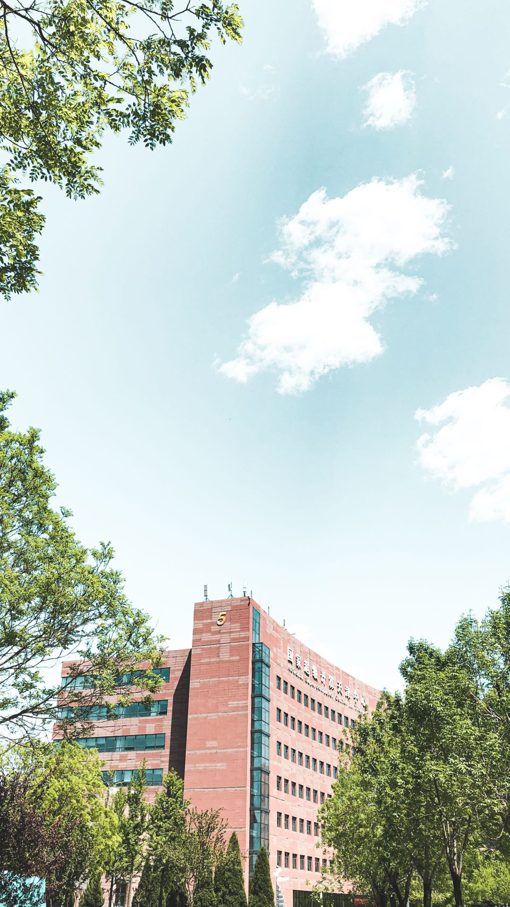

# 自我介绍
## 个人基本信息

* 姓名：磊磊
* 身高：183
* 体重：70KG
* 年龄：28
* 星座：白羊座

我的爱好是摄影，但目前也只是略懂皮毛，如果有喜欢摄影的同学可以一起交流，下面是我用手机拍的一张照片：



## 学习目标
1. 能跟随老师讲解理解课程内容;
2. 能够完成随堂作业；
3. 能够学以致用，举一反三；
4. 能够参与完成项目的制作。
   
没有学过编程，作为小白我要从头学起，先写个代码鼓励下自己

```javascript
function f(){
    console.log('Come on')
}
f()